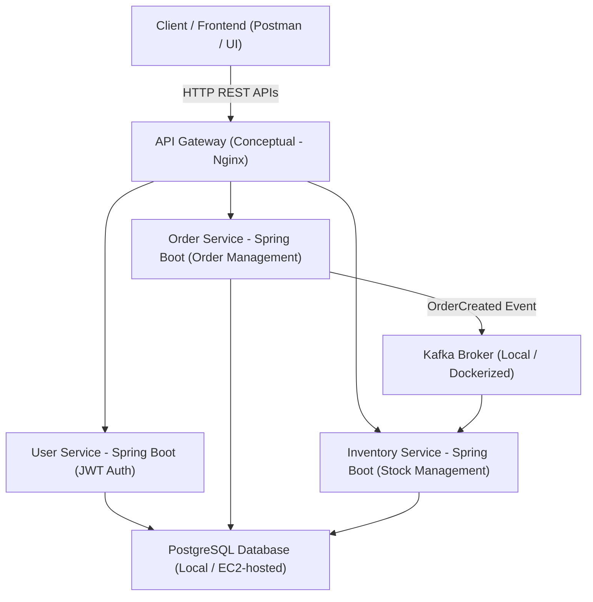

🚀 SwiftKart Backend
Event-Driven Microservices E-Commerce System

SwiftKart is a production-oriented e-commerce backend built using Spring Boot microservices, Kafka-based asynchronous communication, and cloud deployment on AWS EC2.

This project demonstrates real-world backend architecture, service decoupling, and scalable system design, focusing purely on backend engineering best practices.

## 🏗️ System Architecture

🧠 Architecture Highlights

Microservices-based design with clear separation of responsibilities

Event-driven communication using Kafka to decouple services

JWT-based authentication & authorization

Stateless services enabling horizontal scalability

Dockerized deployment for consistency across environments

Cloud-aware design compatible with AWS free tier

🧩 Services Overview
🔐 User Service

User registration & login

JWT token generation and validation

Centralized authentication and authorization logic

📦 Order Service

Order creation and management

Publishes OrderCreated events to Kafka

Does not directly call Inventory Service (loose coupling)

🏪 Inventory Service

Consumes Kafka events asynchronously

Updates product stock based on order events

Designed to handle failures independently

⚙️ Tech Stack
Backend

Java 17

Spring Boot 3+

Spring Security (JWT)

Spring Data JPA

Apache Kafka (Producer & Consumer)

Lombok

Database

PostgreSQL

Build & Deployment

Docker & Docker Compose

AWS EC2 (Free Tier)

Postman (API testing)

📁 Project Structure
SwiftKart-Backend/
 ├── user-service/
 ├── order-service/
 ├── inventory-service/
 ├── docker-compose.yml
 └── README.md

🚀 Deployment Strategy
🧪 Local / Containerized Environment

All services run using Docker Compose

Kafka and Zookeeper run locally in containers

PostgreSQL runs as a containerized database

☁️ Cloud Deployment (AWS EC2)

Spring Boot services deployed on AWS EC2

Kafka used locally due to free-tier constraints

In production, Kafka can be replaced with:

AWS MSK

Confluent Cloud

Other managed messaging services

This mirrors real-world practices where managed services are preferred in production environments.

📌 API Documentation (Postman)
🔗 Postman Collection

👉 https://documenter.getpostman.com/view/43458909/2sB3dSR9N6

Includes:

Authentication APIs

Order APIs

Inventory APIs

End-to-end request flow testing

🧪 Key Engineering Concepts Demonstrated

Microservices architecture

Event-driven systems

Asynchronous processing

Service decoupling

JWT-based security

Dockerized deployments

Cloud-aware backend design

🔮 Future Enhancements

API Gateway implementation (Spring Cloud Gateway / Nginx)

Centralized logging & monitoring

Kubernetes-based deployment

Retry and dead-letter queues in Kafka

Redis-based caching

👨‍💻 Author

Anirudh Ashrit
Backend Developer | Spring Boot | Distributed Systems
